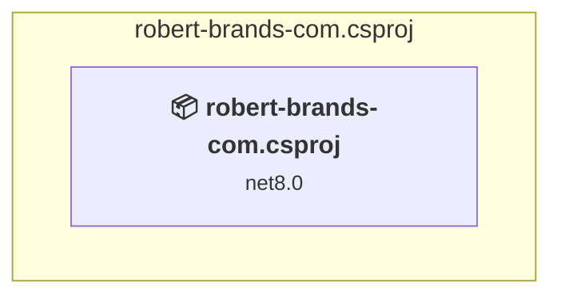

# Projects and dependencies analysis

This document provides a comprehensive overview of the projects and their dependencies in the context of upgrading to .NETCoreApp,Version=v10.0.

## Table of Contents

- [Executive Summary](#executive-Summary)
  - [Highlevel Metrics](#highlevel-metrics)
  - [Projects Compatibility](#projects-compatibility)
  - [Package Compatibility](#package-compatibility)
  - [API Compatibility](#api-compatibility)
- [Aggregate NuGet packages details](#aggregate-nuget-packages-details)
- [Top API Migration Challenges](#top-api-migration-challenges)
  - [Technologies and Features](#technologies-and-features)
  - [Most Frequent API Issues](#most-frequent-api-issues)
- [Projects Relationship Graph](#projects-relationship-graph)
- [Project Details](#project-details)

  - [robert-brands-com.csproj](#robert-brands-comcsproj)

## Executive Summary

### Highlevel Metrics

| Metric | Count | Status |
| :--- | :---: | :--- |
| Total Projects | 1 | All require upgrade |
| Total NuGet Packages | 11 | 1 need upgrade |
| Total Code Files | 105 |  |
| Total Code Files with Incidents | 4 |  |
| Total Lines of Code | 8151 |  |
| Total Number of Issues | 16 |  |
| Estimated LOC to modify | 12+ | at least 0,1% of codebase |

### Projects Compatibility

| Project | Target Framework | Difficulty | Package Issues | API Issues | Est. LOC Impact | Description |
| :--- | :---: | :---: | :---: | :---: | :---: | :--- |
| [robert-brands-com.csproj](#robert-brands-comcsproj) | net8.0 | 🟢 Low | 3 | 12 | 12+ | AspNetCore, Sdk Style = True |

### Package Compatibility

| Status | Count | Percentage |
| :--- | :---: | :---: |
| ✅ Compatible | 10 | 90,9% |
| ⚠️ Incompatible | 0 | 0,0% |
| 🔄 Upgrade Recommended | 1 | 9,1% |
| ***Total NuGet Packages*** | ***11*** | ***100%*** |

### API Compatibility

| Category | Count | Impact |
| :--- | :---: | :--- |
| 🔴 Binary Incompatible | 11 | High - Require code changes |
| 🟡 Source Incompatible | 0 | Medium - Needs re-compilation and potential conflicting API error fixing |
| 🔵 Behavioral change | 1 | Low - Behavioral changes that may require testing at runtime |
| ✅ Compatible | 44533 |  |
| ***Total APIs Analyzed*** | ***44545*** |  |

## Aggregate NuGet packages details

| Package | Current Version | Suggested Version | Projects | Description |
| :--- | :---: | :---: | :--- | :--- |
| Azure.Storage.Queues | 12.22.0 |  | [robert-brands-com.csproj](#robert-brands-comcsproj) | ✅Compatible |
| Flurl | 4.0.0 |  | [robert-brands-com.csproj](#robert-brands-comcsproj) | ✅Compatible |
| Flurl.Http | 4.0.2 |  | [robert-brands-com.csproj](#robert-brands-comcsproj) | ✅Compatible |
| Ical.Net | 4.3.1 |  | [robert-brands-com.csproj](#robert-brands-comcsproj) | ✅Compatible |
| Microsoft.ApplicationInsights.AspNetCore | 2.23.0 |  | [robert-brands-com.csproj](#robert-brands-comcsproj) | ✅Compatible |
| Microsoft.AspNetCore.Authentication.AzureAD.UI | 6.0.36 |  | [robert-brands-com.csproj](#robert-brands-comcsproj) | Needs to be replaced with Replace with new package Microsoft.Identity.Web=4.6.0 |
| Microsoft.Azure.Cosmos | 3.48.1 |  | [robert-brands-com.csproj](#robert-brands-comcsproj) | ✅Compatible |
| Microsoft.Identity.Web | 3.8.3 |  | [robert-brands-com.csproj](#robert-brands-comcsproj) | ✅Compatible |
| Microsoft.VisualStudio.Web.CodeGeneration.Design | 8.0.7 | 10.0.2 | [robert-brands-com.csproj](#robert-brands-comcsproj) | Ein NuGet-Paketupgrade wird empfohlen |
| NetEscapades.AspNetCore.SecurityHeaders | 1.0.0 |  | [robert-brands-com.csproj](#robert-brands-comcsproj) | ✅Compatible |
| reCAPTCHA.AspNetCore | 3.0.10 |  | [robert-brands-com.csproj](#robert-brands-comcsproj) | ✅Compatible |

## Top API Migration Challenges

### Technologies and Features

| Technology | Issues | Percentage | Migration Path |
| :--- | :---: | :---: | :--- |

### Most Frequent API Issues

| API | Count | Percentage | Category |
| :--- | :---: | :---: | :--- |
| M:Microsoft.Extensions.Configuration.ConfigurationBinder.Get''1(Microsoft.Extensions.Configuration.IConfiguration) | 5 | 41,7% | Binary Incompatible |
| M:Microsoft.Extensions.DependencyInjection.OptionsConfigurationServiceCollectionExtensions.Configure''1(Microsoft.Extensions.DependencyInjection.IServiceCollection,Microsoft.Extensions.Configuration.IConfiguration) | 4 | 33,3% | Binary Incompatible |
| M:Microsoft.Extensions.Configuration.ConfigurationBinder.GetValue''1(Microsoft.Extensions.Configuration.IConfiguration,System.String) | 2 | 16,7% | Binary Incompatible |
| M:Microsoft.AspNetCore.Builder.ExceptionHandlerExtensions.UseExceptionHandler(Microsoft.AspNetCore.Builder.IApplicationBuilder,System.String) | 1 | 8,3% | Behavioral Change |

## Projects Relationship Graph

Legend:
📦 SDK-style project
⚙️ Classic project

## Project Details

### robert-brands-com.csproj

#### Project Info

- **Current Target Framework:** net8.0
- **Proposed Target Framework:** net10.0
- **SDK-style**: True
- **Project Kind:** AspNetCore
- **Dependencies**: 0
- **Dependants**: 0
- **Number of Files**: 127
- **Number of Files with Incidents**: 4
- **Lines of Code**: 8151
- **Estimated LOC to modify**: 12+ (at least 0,1% of the project)

#### Dependency Graph

Legend:
📦 SDK-style project
⚙️ Classic project

### API Compatibility

| Category | Count | Impact |
| :--- | :---: | :--- |
| 🔴 Binary Incompatible | 11 | High - Require code changes |
| 🟡 Source Incompatible | 0 | Medium - Needs re-compilation and potential conflicting API error fixing |
| 🔵 Behavioral change | 1 | Low - Behavioral changes that may require testing at runtime |
| ✅ Compatible | 44533 |  |
| ***Total APIs Analyzed*** | ***44545*** |  |

